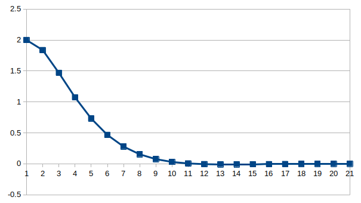

# discrete LQR controller based on C++
* This project gives an example, which can be modified by users.    
* Every block during option start and option end should be modified by users according to the actual situation, where contains necessary parameters and printing options.   
* Need to pre install dependency `Eigen`:    
  `sudo apt-get install libeigen3-dev`      
  `sudo ln -s /usr/include/eigen3/Eigen /usr/include/Eigen`    
* Provide simple parameter type checking function & analysis of calculation results.   
* Users can set parameter `SYSTEM_TYPE` in `CONTINUOUS` or `DISCRETE` according to the actual situation known by users. If users input the information of a continuous system, this component can trans that into discrete.     
* Midpoint Euler method & Backward Euler method are used to trans system discretization if necessary.   
* In `main` function, a loop is used to simulate the normal operation of a classical 1-dim position-velocity-acceleration system.     

$$\begin{bmatrix}p_{k+1}\\\\v_{k+1}\end{bmatrix} =
  \begin{bmatrix}1 & T\\\\0 & 1\end{bmatrix} \cdot \begin{bmatrix}p_{k}\\\\v_{k}\end{bmatrix} + 
  \begin{bmatrix}\frac{1}{2} \cdot T^2 \\\\T\end{bmatrix} \cdot u_k$$      
   
* The test result is as the follow figure, as the time going, the state variable of the system converge to 0. the number of iterations is 20:     

  

* Reference:    
 [连续方程的离散化与离散LQR原理](https://www.bilibili.com/video/BV1P54y1m7CZ?spm_id_from=333.999.0.0&vd_source=6b01284a4db6107be5de403363beb644)      
 [迭代法求黎卡提（Riccati）方程的解](https://blog.csdn.net/ChenGuiGan/article/details/116495061)  
 
